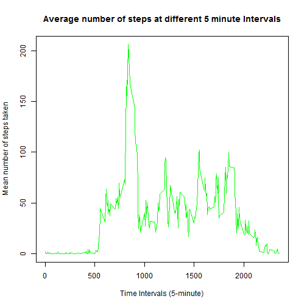
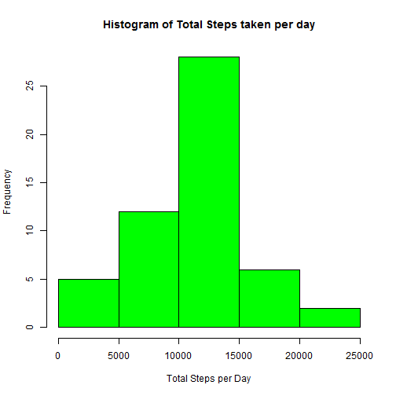

# Reproducible Research: Peer Assessment 1

## Lets load up the libraries.

```r
library(lattice)
```

## Loading and preprocessing the data
Extract zip file and load data from csv

```r
data <- read.csv(unz("activity.zip", filename="activity.csv"))
```

Fix Dates

```r
data$date <- as.Date(data$date,"%Y-%m-%d")
```

## What is mean total number of steps taken per day?
Compute total number of steps per day  

```r
totalStepPerDay <- tapply(data$steps, data$date,sum)
```

Plot histogram of total number of steps per day

```r
hist(totalStepPerDay,col="green",xlab="Total Steps per Day", 
      ylab="Frequency", main="Histogram of Total Steps taken per day")
```

 

Mean total steps taken per day

```r
mean(totalStepPerDay,na.rm=TRUE)
```

```
## [1] 10766
```

Median total steps taken per day

```r
median(totalStepPerDay,na.rm=TRUE)
```

```
## [1] 10765
```

## What is the average daily activity pattern?
Mean steps over days by 5 minute time interval

```r
meanInterval <- tapply(data$steps,data$interval,mean,na.rm=TRUE)
```
Plot of of the 5-minute interval and the average number of steps taken, averaged across all days

```r
plot(row.names(meanInterval),meanInterval,type="l",
     xlab="Time Intervals (5-minute)", 
     ylab="Mean number of steps taken", 
     main="Average number of steps at different 5 minute Intervals",
     col="green")
```

 

The time interval that contains maximum average number of steps over all days

```r
interval <- which.max(meanInterval)
intervalMaxStep <- names(interval)
intervalMaxStep
```

```
## [1] "835"
```
The 835 minute  or  104th 5 minute interval contains the maximum number of steps on average across all the days.

## Imputing missing values
Compute the number of NA values in the activity dataset

```r
num_na_values <- sum(is.na(data))
num_na_values #Print number of NA values
```

```
## [1] 2304
```

Fill in missing values; *use average interval value across all days*

```r
na_indices <-  which(is.na(data))
imputed_values <- meanInterval[as.character(data[na_indices,3])]
names(imputed_values) <- na_indices
for (i in na_indices) {
    data$steps[i] = imputed_values[as.character(i)]
}
sum(is.na(data)) # The number of NAs after imptation should be 0
```

```
## [1] 0
```

## Are there differences in activity patterns between weekdays and weekends?


```r
days <- weekdays(data$date)
data$day_type <- ifelse(days == "Saturday" | days == "Sunday", "Weekend", "Weekday")

meanDay <- aggregate(data$steps,by=list(data$interval,data$day_type),mean)

names(meanDay) <- c("interval","day_type","steps")

xyplot(steps~interval | day_type, meanDay,type="l",layout=c(1,2),xlab="Interval",ylab = "Number of steps",col="green")
```

 

Figure out the min, max, mean, median for steps over all intervals and days by weekdays or weekends

```r
tapply(meanDay$steps,meanDay$day_type, 
       function (x) { 
          c(MIN=min(x),MAX=max(x),MEAN=mean(x), MEDIAN=median(x))
       }
      )
```

```
## $Weekday
##    MIN    MAX   MEAN MEDIAN 
##   0.00 230.38  35.61  25.80 
## 
## $Weekend
##    MIN    MAX   MEAN MEDIAN 
##   0.00 166.64  42.37  32.34
```

